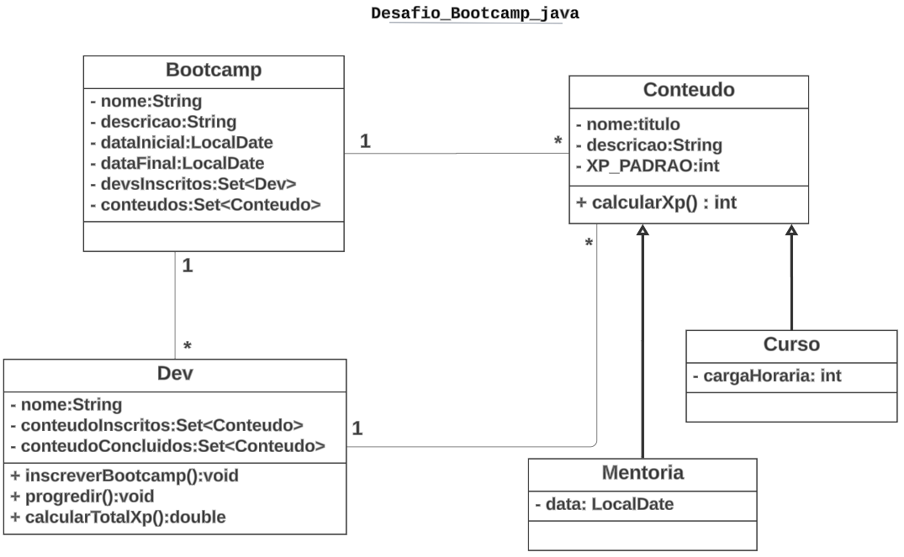

# Resumo

### Este projeto é um sistema de gestão de bootcamps desenvolvido para reforçar os conhecimentos no paradigma de programação orientada a objetos (POO) em Java. O sistema modela as principais entidades e relacionamentos presentes em um ambiente de bootcamp, incluindo cursos, mentorias e desenvolvedores (Devs).

# Diagrama de Classes UML

# Classes Principais:

- ### ***Bootcamp:*** Representa um bootcamp que possui um nome, descrição, data de início, data de fim, uma lista de desenvolvedores inscritos e uma lista de conteúdos (cursos e mentorias).
- ### ***Conteudo:*** Classe abstrata que serve de base para diferentes tipos de conteúdo oferecidos no bootcamp, como cursos e mentorias. Contém atributos comuns como título e descrição.
- ### ***Curso:*** Herda de Conteudo e inclui atributos específicos como carga horária. Implementa o método para calcular a XP.
- ### ***Mentoria:*** Herda de Conteudo e inclui um atributo para a data da mentoria. Também implementa o cálculo de XP específico para mentorias.
- ### ***Dev:*** Representa um desenvolvedor que pode se inscrever em bootcamps, progredir em seus estudos e calcular a XP total adquirida. Contém listas de conteúdos inscritos e concluídos.

# Relações entre Classes:

- ### ***Herança:*** Curso e Mentoria herdam de Conteudo, permitindo reutilizar e estender funcionalidades comuns.
- ### ***Composição:*** Bootcamp contém listas de Conteudo e Dev, modelando a relação "tem um". Dev contém listas de Conteudo para gerenciar conteúdos inscritos e concluídos.

# Funcionamento do Sistema

- ### ***Inscrição:*** Desenvolvedores podem se inscrever em um bootcamp, automaticamente adicionando todos os conteúdos disponíveis do bootcamp às suas listas de conteúdos inscritos.
- ### ***Progresso:*** Desenvolvedores podem progredir através dos conteúdos inscritos, movendo-os para a lista de conteúdos concluídos.
- ### ***Cálculo de XP:*** A XP total de um desenvolvedor é calculada somando a XP de todos os conteúdos concluídos, incentivando a conclusão de cursos e mentorias.
